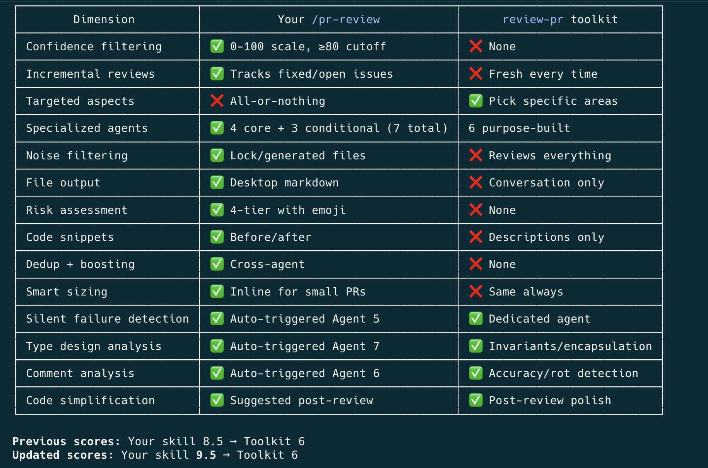

# claude-pro-skills

A Claude Code toolkit — **23 skills, no prefix to type**. Shipping pipelines (new app / ticket / release), code reviews (PR / local / full-repo audit), git workflow, Claude meta tasks, external integrations, and per-project knowledge vaults.

> **Heads up**: examples throughout use placeholder names — `acme`/`beacon` projects, `acme`/`work` Jira instances, `ACME-####` ticket prefixes. They're illustrative; the plugin works for any project. Two spots hold config you replace with your own: the **Project Map** in `/save-session-to-worklog` and the vault registry under `~/.config/claude-pro-skills/vaults.json`.

## Installation

```
/plugin marketplace add bernardorubin/claude-pro-skills
/plugin install claude-pro-skills@claude-pro-skills
/reload-plugins
```

## Skills only — no prefix

Every entry below is a **skill** invocable as `/<name>` (no `claude-pro-skills:` prefix). Skills appear in the slash palette and **auto-trigger** when you describe the task in plain English.

## Shipping pipelines

### `/create-app`
Zero to **first** release. The one-time gauntlet that `/ship-ticket` and `/cut-release` assume is already done: shape the idea into an approved spec (`brainstorming` → `writing-plans`), build it, then survive the seams between services where first releases actually die. It exists for one repeated failure shape — **a dashboard shows a provider "enabled" while its credentials, allowlists, integrations and native app registrations were never copied from dev**, so the app shows no error, just a blank screen or an empty list, and you debug working code for a day. Carries three loaded checklists: `production-auth.md` (the "nothing was copied" audit, plus the client traps where an unauthenticated query returns `[]` and a returning user looks brand new), `foundations.md` (the day-0 calls that later cost a full review cycle — chiefly that **OTA support must be compiled into the binary before the first submission**), and `store-submission.md` (privacy policy, in-app account deletion, App Privacy answers, DSA trader status, and the silent trap of a version keeping an **older** build attached). Holds the same hard line as the other two: builds freely, **never submits, publishes, or ships an OTA** — and "Add for Review" is always your click. Hands off to `/cut-release` the moment v1 is approved. Auto-triggers on "let's build an app", "new app idea", "take this app to the App Store".

### `/ship-ticket`
The full ship pipeline for a Jira ticket (or a described feature/bugfix): understand → clarify (hard stop — no code until questions are answered) → implement on a `--no-track` branch → open the PR → self-review loop (asks first, then runs `/review-cycle`: living PR comment, fix, push, until clean) → address external review → log to worklog + vault → draft a Slack update → hand back the deploy command. It's a **conductor** — it chains your other skills (`jira-cli`, `git-ac`, `pr-description`, `pr-review`, `save-session-to-worklog`, `save-to-vault`, `write-slack-message`) in order and holds two lines: do the work yourself instead of deferring it, and stop before anything that deploys. **Project-agnostic by design** — it reads the repo's `CLAUDE.md` for the base branch, quality gates, PR flow, designated reviewer, dashboards, and deploy command, so it adapts per project instead of hardcoding any. Auto-triggers on "ship ABC-123", "take this ticket end to end", "implement ABC-456 and open a PR".

### `/cut-release`
The per-**release** complement to `/ship-ticket` (which is per-**ticket** and stops at a review-ready PR). When you cut a release, this takes the already-merged code to a submittable build: **pre-flight the release gates first** (is the App Store version train open? build slot free? CI green? version bumped?) — the check that kills the "the version train was already released" upload failure — then bump if needed, build the artifact (you allow `eas build` / local builds / `expo export`), generate release notes from the merged tickets, log it, draft the ship update, and **hand back the exact submit command**. Holds the same hard line as `/ship-ticket`: Claude builds to ready, **never runs the submit / OTA / store publish** — you run that. Multi-target and project-agnostic: reads the repo's `CLAUDE.md` for the release target(s), version scheme, build vs submit commands, and gate dashboards. Auto-triggers on "cut a release", "ship a build", "prep the release", "new App Store build". Many `/ship-ticket` runs merge → one `/cut-release` cuts the version.

### `/investigate`
Diagnose a production anomaly, bug report, or "why is X happening" — grounded in real evidence, not a guess. Built for the common shape: paste a Slack thread, get back a reply ready to drop into that same thread. Enforces the investigation discipline — **dashboard metrics → raw logs → code**, make zero assumptions, investigate yourself before asking anyone — and it's strictly **read-only** (surfaces a fix for you to decide; hands off to `/ship-ticket` if you want it built). Reads the repo's `CLAUDE.md` "Dashboards & Data Sources" section to know where the truth lives. Auto-triggers on "investigate X", "look into why Y", "figure out what's going on with Z", or pasting an incident/alert/error.

## Git

### `/git-ac`
Stage all changes, generate a concise commit message from the diff, commit (no AI co-author lines), **no push**. Use when the remote blocks pushes (branch protection, pre-receive hooks) or when you want to batch commits locally before pushing yourself.

### `/git-pull-reapply`
Bring the current branch up to date with remote while preserving local work. Handles four scenarios:
1. Clean tree + fast-forward → simple `git pull`
2. Uncommitted changes + fast-forward → stash, pull, pop
3. Clean tree + divergent branches → rebase local commits onto remote
4. Uncommitted changes + divergent branches → stash, rebase, pop

Always rebases over merging so history stays linear.

## Claude meta

### `/claude-learn`
Reviews the current session and documents valuable learnings into the right CLAUDE.md files (global, project root, or module). Helps future sessions start smarter.

```
/claude-learn                # Review whole session
/claude-learn <learning>     # Document a specific learning
```

### `/claude-modularize`
Breaks down a large, monolithic CLAUDE.md into smaller, scoped files distributed across the project's directory structure (component-specific guidelines move next to components, etc.).

### `/handoff`
Compacts the current conversation into a self-contained handoff document at `~/Desktop/handoff-<slug>.md` so a fresh `claude` session or another agent can pick up exactly where this one left off. Captures the task, current git/PR state (committed vs pushed vs built vs waiting-to-publish), key decisions and ruled-out approaches, gotchas (confirmed vs suspected), concrete next steps, key files/artifacts by reference, and a suggested-skills list. References other artifacts (PRDs, plans, diffs) instead of restating them, and redacts secrets. Optional argument describes what the next session will focus on. Auto-triggers on "write a handoff doc", "hand this off to a new session", "context is getting long, write a handoff".

### `/update-claude-pro-skills`
Updates this toolkit to its latest published version without you remembering the `/plugin` incantations. Runs the non-interactive `claude plugin` CLI — `marketplace update claude-pro-skills` then `update claude-pro-skills@claude-pro-skills` (the verb that actually upgrades; `install` no-ops when already installed) — reports the old → new version, and reminds you to run `/reload-plugins` (or restart) to apply it in the current session (it's automatic next session; a skill can't run `/reload-plugins` itself since that's interactive UI). Falls back to handing you the manual slash commands if the CLI isn't available. Just pulls the newest published build — for changing what a skill *does*, that's an edit to its SKILL.md. Auto-triggers on "update the claude pro skills", "update my skills to the latest", "update the toolkit".

## Integrations

### `/prd-to-jira`
Breaks down a PRD, spec, or feature document into a Jira epic with well-structured, right-sized tickets organized by work area. Auto-triggers when you share a PRD or ask to "create tickets", "break this down", "make Jira tasks".

```
/prd-to-jira                          # Expects PRD pasted in conversation
/prd-to-jira <path-or-url-or-key>     # Path, URL, or Jira ticket key
```

### `/save-session-to-worklog`
Logs the current session's work into a monthly worklog file. **Vault-aware**: if the current project is registered in `~/.config/claude-pro-skills/vaults.json` (via `/vault-init` or the `vault-keeper` skill), the worklog lands in `{vault}/raw/work-logs/<user-slug>/` and an entry is appended to `{vault}/wiki/log.md`. Otherwise falls back to `~/Desktop/`. For standups and invoicing — not git history. Auto-detects the project; multiple repos belonging to the same project share one file.

```
/save-session-to-worklog                       # Auto-detect project
/save-session-to-worklog --project acme        # Force project name
```

### `/standup`
The read-back companion to `/save-session-to-worklog`: it writes daily-standup notes **from the worklog** (the ground truth the worklog skill wrote) to `~/Desktop/standup-YYYY-MM-DD.pdf`, so the update reflects what actually got done rather than what you half-remember. Reads the last working day's entries (vault-aware, same source), optionally confirms ticket status with `jira-cli`, pulls "today" from your in-progress tickets or a quick ask, and keeps it to 3-6 one-line bullets (Yesterday / Today / Blockers). PDF conversion uses macOS's built-in `cupsfilter` — no extra tooling. If the worklog has nothing logged for the last working day, it says so instead of inventing a standup. Auto-triggers on "write my standup", "standup update", "what did I do yesterday for standup".

## Knowledge vaults

### `/vault-init`
Scaffold a Karpathy-style LLM Wiki vault for the current project. Interactive: asks for vault path, project path, git, and (optionally) a private GitHub repo. Writes a generic `CLAUDE.md` schema, sets up `raw/`/`wiki/`/`templates/`, and registers the project → vault mapping in `~/.config/claude-pro-skills/vaults.json` so the `vault-keeper` skill auto-engages.

```
/vault-init                            # Interactive
/vault-init ~/MyProjectVault           # Specify vault path; still asks the rest
```

After init, drop sources into `{vault}/raw/`, ask Claude to ingest, and browse the result in [Obsidian](https://obsidian.md). The vault auto-updates during sessions in the registered project.

### `/vault-resolve-conflicts`
Auto-resolve merge/stash conflicts in vault markdown by keeping BOTH the incoming and local changes for every conflict block (union merge). Designed for `wiki/log.md`, `wiki/index.md`, and other append-only/list-style vault files where union-merging is almost always the right call. Vault-only — refuses to run outside a registered vault. After resolving, surfaces near-duplicate adjacent lines (the "same fact, two phrasings" pattern) for the user to pick one.

```
/vault-resolve-conflicts
```

### `/vault-keeper`
Reads from and writes to a registered project's knowledge vault (Karpathy-style LLM Wiki). Auto-fires when documenting findings (architecture decisions, integration quirks, debugging discoveries, team facts), looking up domain context, ingesting raw sources, or asking for a vault lint. Resolves the current cwd against `~/.config/claude-pro-skills/vaults.json`; if no vault is registered for the project, the skill self-terminates silently. Each vault carries its own `CLAUDE.md` (the schema authority) — the skill defers to it for project-specific rules.

**Four modes triggered by user intent:**

- **Read** — domain questions ("what does X do?", "who owns Y?"). Reads `wiki/index.md`, follows links, synthesizes with citations to specific wiki pages.
- **Write** — proactive auto-update. When you encounter an integration quirk, architectural decision, debugging finding, or team fact worth preserving, the skill files it into the relevant `wiki/` subfolder and updates `index.md` + `log.md`. No permission needed for small touches.
- **Ingest** — adding a new raw source. Discusses takeaways with the user before writing, then creates a summary page + updates concept/entity pages, all cross-linked.
- **Lint** — surfaces orphans, contradictions, stub pages, stale claims, format violations, and index drift. Reports without auto-fixing.

To set up a new vault, use `/vault-init`.

### `/save-to-vault`
A deliberate end-of-session sweep that files everything valuable from the **whole conversation** into the vault in one pass. Where `vault-keeper` writes facts incidentally as they surface during work, this is the explicit "we're done, capture what we learned" command — the session-level analogue of `vault-keeper`'s ingest mode, with the conversation itself as the source. It defers to `vault-keeper`'s write-mode rules and the vault's own `CLAUDE.md` for page format, citations, and the index/log update; its added value is scope (review the entire session) and dedup (skip anything `vault-keeper` already filed this session). If no vault is registered for the project, it says so and points to `/vault-init` rather than self-terminating silently.

```
/save-to-vault                                 # Sweep the whole session into the wiki
/save-to-vault save whatever's valuable        # Same, natural-language form
```

Complementary to `/save-session-to-worklog`: the worklog records *what you did* (standups/invoicing, `raw/work-logs/`); `save-to-vault` records *what you learned* (cross-linked domain knowledge, `wiki/`). Running both at session end is a reasonable habit.

### `/wrap-session`
The "do both" end-of-session command, for when you'd otherwise type `/save-session-to-worklog` and `/save-to-vault` back to back. It's a thin conductor: it invokes `save-session-to-worklog` first (forwarding any args — freetext notes, `--project`, `--dry`), then `save-to-vault`, then gives one combined report. It reimplements neither; each sub-skill's rules (project detection, vault routing, dedup, git-sync) apply unchanged. `--dry` previews the worklog and skips the vault write.

```
/wrap-session                                  # Worklog + vault sweep in one pass
/wrap-session also paired with Ana on the API  # Forwards the note to the worklog step
/wrap-session --dry                            # Preview the worklog, write nothing
```

## PR helpers

### `/pr-description`
Generates a GitHub-ready PR description from the diff and updates the PR directly via `gh`. Falls back to saving to `~/Desktop/pr-description.md` if the GitHub update fails. Auto-triggers on phrases like "write a PR description", "draft the PR body", "update the PR".

```
/pr-description              # Auto-detect PR from current branch
/pr-description 463          # Specific PR by number
/pr-description <pr-url>     # Specific PR by URL
```

### `/write-slack-message`
Drafts a Slack message ready to copy-paste, with proper formatting and a business-casual tone. Saves to `~/Desktop/slack-message.md`. Auto-triggers on phrases like "draft a slack message", "how should I phrase this for slack", "write up a slack post".

## Jira

### `/jira-cli`
Read/update/comment/transition Jira tickets directly from the shell via the bundled `jira-curl` CLI. Supports multiple Jira instances per machine (e.g. work + personal). Auto-triggers when you paste a Jira URL or key (`ACME-1234`, `WEB-456`) or say things like "update the description on ABC-123", "add a comment to …", "what's the status of …", "move this to In Progress".

**First-time setup:** the skill self-installs on first use — Claude detects the missing binary, runs the bundled installer, and prompts you for credentials. If you'd rather set it up manually:

```
bash "$(ls -dt ~/.claude/plugins/cache/*/claude-pro-skills/*/skills/jira-cli/scripts/jira-curl 2>/dev/null | head -1)" install
jira-curl init <name>      # interactive: base URL + email + API token
jira-curl list             # show configured instances
```

Credentials are stored at `~/.config/jira/credentials` with mode 600. Add as many instances as you need by re-running `jira-curl init <name>`. If `~/.local/bin` isn't on your `$PATH`, the installer prints the export line to add to your shell rc.

## Code review

### `/pr-review` — Confidence-scored code reviews (3 modes)

Runs multiple focused review agents in parallel, each examining the code from a different angle (security, correctness, code quality, performance). Findings are scored on a 0-100 confidence scale, and only issues scoring 80+ are surfaced — cutting noise while catching real problems. Results are saved to a markdown file you can share, reference later, or track progress against as you fix issues.

**Scope:** General-purpose, optimized for TypeScript/JavaScript projects. Works with any language but includes specialized checks for React, Next.js, and TypeScript codebases. Frontend-specific checks (re-renders, bundle size, accessibility) only fire when relevant to the changed files.

#### The three modes

| Mode | When | Input | Output filename |
|------|------|-------|-----------------|
| **PR** (default) | A PR number is given or auto-detected from the current branch | The PR's diff | `pr-review-{number}.md` |
| **Local** | No PR exists, OR `--local` flag, OR you ask to "review my uncommitted work" / "review my branch" | `git diff origin/main...HEAD` + uncommitted | `pr-review-{branch}.md` |
| **Full repo** | `--full-repo` flag, OR you ask for a "full repo audit" / "audit the whole codebase" | Every source file (with sensible exclusions) — confirms before running on >50 files | `code-audit-{repo}.md` |

#### Usage

Auto-triggers on natural language. Examples:

```
review PR #463                           → PR mode
run a pr review                          → Auto-detect PR; falls back to local if none
review PR 463 in lite mode               → Lightweight: fewer agents, diff-only
review my uncommitted changes            → Local mode
audit my branch                          → Local mode
audit the whole repo                     → Full repo mode (asks to confirm if >50 files)
do a full repo audit in lite mode        → Full repo + lite
```

Or invoke explicitly via slash with flags:

```
/pr-review --local
/pr-review --full-repo
/pr-review --full-repo --lite
/pr-review 463 --comment
```

**GitHub-comment ready.** The review file renders cleanly as a PR comment: compact header, findings linked to the PR's head commit, minor sections collapsed in `<details>`. Pass `--comment` (PR mode) to post it directly — the skill maintains one living review comment per PR, updated in place on every re-run.

#### Modes

| | Full (default) | Lite |
|---|---|---|
| **Core agents** | 4 specialized (security, correctness, quality, performance) | 2 combined (security+correctness, quality+performance) |
| **Specialist agents** | Up to 3 additional (silent failures, comments, types) when triggered | Same triggers apply |
| **File reading** | Every changed file read in full | Diff only, selective file reads |
| **Code snippets** | Before/after fix suggestions included | Descriptions only |
| **Subagent model** | Your active model | Sonnet |
| **Direct review threshold** | ≤3 files / ≤150 lines | ≤8 files / ≤500 lines |
| **Best for** | Final reviews, security-sensitive changes, large PRs | Day-to-day PRs, quick checks, iterating on fixes |

**Tip:** Run a full review first, then use lite for re-checks as you iterate. Both write to the same file.

#### The Review Loop

The skill is designed for iterative use, not just one-shot reviews.

```
1. Run pr-review            → Initial review, issues identified
2. Fix the flagged issues    → Make code changes
3. Run pr-review again       → Resolved issues marked ✅ Fixed (strikethrough),
                               new issues from your fixes surfaced
4. Repeat                    → Until the review is clean
```

When the skill detects a prior review file (same PR, same day):
- **Resolved issues** get ~~strikethrough~~ with a ✅ Fixed badge — they stay visible for history but are excluded from issue counts
- **Still-open issues** remain unchanged
- **New issues** are appended to the appropriate severity section
- **Issue counts and risk level** are recalculated based on open issues only
- **A revision entry** is added to the log at the bottom of the file

#### Review Agents

**Core agents (always run in full mode)**

- **Agent 1 — Security** (*think like an attacker*): input validation, injection (SQL/XSS/command), authn/authz bypass, sensitive data exposure, CSRF/CORS/headers, insecure deserialization, breaking changes (consumers of modified types/exports/APIs)
- **Agent 2 — Correctness** (*think like a QA engineer*): race conditions, null/undefined handling, logic errors, memory leaks, state management bugs (stale closures, missing React deps), error propagation, edge cases
- **Agent 3 — Code Quality** (*think like a senior reviewer*): TypeScript strictness, SOLID, DRY, naming, project pattern adherence (reads CLAUDE.md), test coverage, missing companion changes (typegen, env vars, etc.)
- **Agent 4 — Performance & UX** (*think like a user on a slow connection*): re-renders/memoization, query/fetching efficiency, bundle size (client vs server), accessibility, loading/error states, cleanup, dependency audit when `package.json` changed

**Specialist agents (triggered automatically when relevant)**

- **Silent Failure Hunter** — fires when diff has try/catch, `.catch()`, `|| fallback`, etc. Looks for swallowed errors, masking fallbacks, missing logging, retries without backoff.
- **Comment Accuracy** — fires when diff adds/modifies 5+ comment lines. Catches comments that contradict code, stale references, undocumented TODOs, JSDoc mismatches.
- **Type Design** — fires when diff introduces new types/interfaces. Flags types allowing invalid states, missing `readonly`, overly broad types (`any`), missed discriminated unions.

**Lite mode** consolidates the 4 core agents into 2 (Security+Correctness, Quality+Performance) and reads diff only. Specialist agents still trigger when relevant.

#### Confidence Scoring

Every finding is scored 0-100:
- **0-49**: likely false positive or pre-existing → filtered out
- **50-79**: might be an issue but below threshold → filtered out
- **80-100**: high confidence → included in review

If 2+ agents independently flag the same issue, severity gets boosted one tier (suggestion → improvement → critical). Cross-agent agreement is a strong signal.

#### Output Format

Reviews saved as `pr-review-{PR_NUMBER}.md` (one stable file per PR — re-runs update it incrementally; dates live in the header and revision log) containing:
- Risk assessment (🟢 LOW / 🟡 MEDIUM / 🔴 HIGH / ⛔ CRITICAL)
- Issues grouped by severity with location, confidence score, impact
- Before/after code snippets (full mode only)
- Breaking changes and dependency notes
- Good practices observed
- Issues indexed by file
- Revision history

#### How It Compares

`pr-review` vs Anthropic's built-in `review-pr` toolkit:



### `/review-cycle`
The review-**and-fix** loop, where `/pr-review` only reviews. It's a thin conductor over `/pr-review`: it reviews the PR and posts the findings as **one living PR comment**, then fixes the findings it judges worth fixing (critical + solid improvements — it leaves nitpicks/false-positives/out-of-scope with a noted reason, not a blind fix-everything), runs the repo's quality gates, pushes, and **edits that same comment in place** on each pass (strikes through what's fixed, surfaces anything new) — looping until clean. The end state is one PR comment that tracked the review to resolution, plus a short summary of what was fixed vs deliberately left. Reach for it when you want the issues *fixed and pushed*, not just listed. `/ship-ticket` invokes it as its self-review step (after asking whether the PR even needs a cycle). Auto-triggers on "run the review cycle", "review and fix this PR", "do the review loop". Never deploys/publishes — a review cycle fixes and pushes, nothing more.

## Subagents

### `code-reviewer`

The bundled review agent behind `/pr-review` (launched as `claude-pro-skills:code-reviewer`). Each parallel instance reviews one focus area — security, correctness, quality, performance, or a specialist pass — and returns confidence-scored, high-signal findings. Not meant to be invoked directly; the skill dispatches it with a full prompt.

## License

MIT
